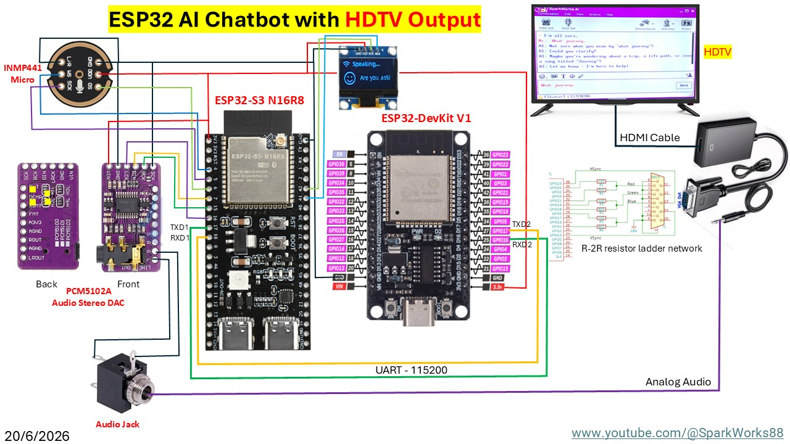

# Vintage Cassette AI Chatbot (ESP32 + HDTV)

Turning a 1987 Sanyo Slim cassette player into a smart AI assistant powered by ESP32-S3.

Watch the video here: [https://www.youtube.com/watch?v=YOUR_VIDEO_ID](https://www.youtube.com/watch?v=Oo-JKjHwuaw)

## 📌 Project Overview
This project breathes new life into a 1987 Sanyo Slim cassette player. By integrating an **ESP32-S3** and the **FabGL library**, I transformed this piece of vintage gear into an interactive AI voice chatbot that displays visual feedback on an HDTV.

## 🚀 Key Features
* **Vintage Restoration:** Upcycling 80s hardware with modern AI capabilities.
* **FabGL Integration:** Generating high-quality graphics on the ESP32 to run on HDTVs.
* **Voice Interaction:** Powered by I2S microphone (INMP441) and speaker modules.
* **HDTV Compatibility:** VGA/Composite video output converted to HDMI.

## 🧱 Hardware Setup
* **Processor:** ESP32-S3
* **Audio:** INMP441 (Mic) & MAX98357A / PCM5102A (Speaker)
* **Display:** VGA/Composite signal output via ESP32, connected to HDTV via an adapter.
